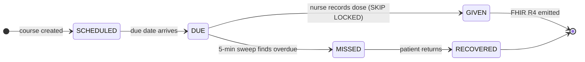
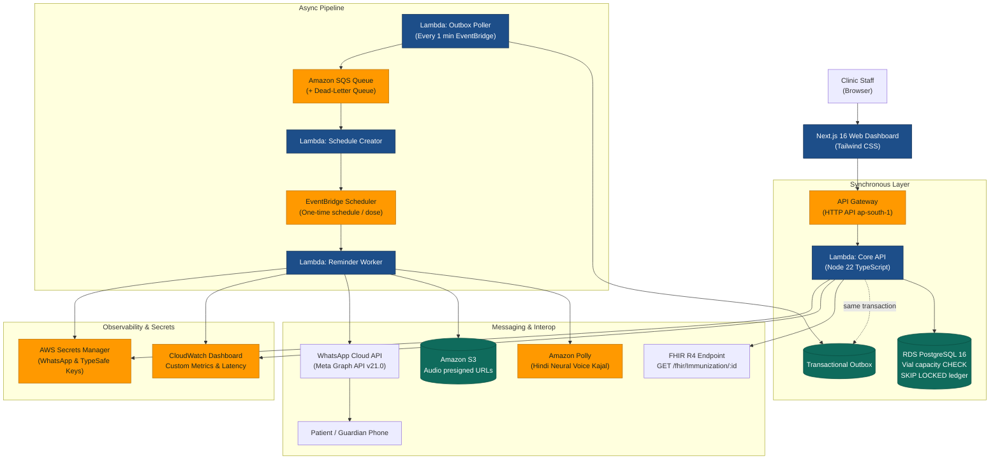

<picture>
  <source media="(prefers-color-scheme: dark)" srcset="docs/banner-dark.svg">
  
</picture>

<p align="center">
  <a href="https://o025clnwai.execute-api.ap-south-1.amazonaws.com"></a>
  <a href="https://github.com/lohitakshcodes/Poora-Teeka/actions/workflows/ci.yml"></a>
  <a href="#see-it-work"></a>
  
  
  <a href="#fhir-r4-immunization-interoperability"></a>
  
</p>

<p align="center">
  <strong><a href="#run-it-locally">Run Locally</a></strong> · 
  <strong><a href="#architecture">Architecture</a></strong> · 
  <strong><a href="#the-engineering-worth-reading-closely">Vial Concurrency Engine</a></strong> · 
  <strong><a href="#fhir-r4-immunization-interoperability">FHIR R4 Standard</a></strong> · 
  <strong><a href="#what-this-deliberately-does-not-do">Safety Scope</a></strong>
</p>

---

Rabies is almost always fatal once symptoms appear, and almost entirely preventable before
they do. The vaccine works. What fails is everything around it.

A patient gets bitten, comes in, gets dose one, and is handed a paper card with four dates
on it. Nobody follows up. Roughly half never come back for all four. Meanwhile the nurse
opened a fresh vial to give that single dose — a vial that holds five doses and expires
eight hours later — and at the end of the shift four doses go in the bin.

**Poora Teeka (पूरा टीका) tracks the course instead of the visit.** It builds the dose calendar,
reminds the patient in a language they speak out loud rather than read, catches the ones
who drop off, and batches tomorrow's patients into the same vial's eight-hour window so
vaccine isn't wasted.

---

## Contents

[The problem](#the-problem) · [What it does](#what-it-does) · [Architecture](#architecture) · 
[AWS Services & Justification](#aws-services-used--why-each-one) · 
[The Engineering Worth Reading Closely](#the-engineering-worth-reading-closely) · 
[FHIR R4 Standard Interoperability](#fhir-r4-immunization-interoperability) · 
[Run It Locally](#run-it-locally) · [Cost](#cost) · 
[What This Deliberately Does Not Do](#what-this-deliberately-does-not-do) · 
[Where the Government Already Is](#where-the-government-already-is) · 
[Credits & AI Tools](#credits-and-licences)

---

## The problem

<p align="center">
  
</p>

Two failures with one root cause — nobody is watching the clock, on either side.

| Metric | Real Clinical Baseline | Impact |
|---|---|---|
| **Dog-bite cases recorded in India, 2024** | **37,17,336** | World's highest rabies burden |
| **Bite victims who receive no vaccine at all** | **1 in 5** | Immediate fatal risk if rabid |
| **Course starters who never complete it** | **close to 50%** | Incomplete neutralization |
| **Vial wastage measured at rural clinics** | **20.8%** (446 vials studied) | Reconstituted vial expires in 8h |
| **Vaccine's share of anti-rabies clinic budget** | **over 94%** | Bulk of programme expenditure |
| **Effect of automated reminders on completion** | **3.37× odds** (*Vaccines* 2023) | Clear technical lever |
| **Usable life of opened intradermal vial** | **8 hours** | Must be discarded at shift end |

<details>
<summary><b>Sourcing for every number above</b></summary>

<br>

- **Bite & Mortality Data**: National Centre for Disease Control (NCDC) and One Health India Rabies Surveillance (2024–2025).
- **Vial Wastage Figure (20.8%)**: Feasibility and wastage evaluation of intradermal post-exposure prophylaxis at a rural primary health centre in Haryana.
- **Clinic Cost Breakdown (94%)**: Health economic assessment of switching from intramuscular to intradermal regimens at an anti-rabies clinic in Delhi.
- **Reminder Trial (3.37×)**: *Vaccines* (2023), randomized study (n=186) measuring completion lift from mobile follow-up in post-exposure rabies prophylaxis.
- **8-Hour Window**: National Guidelines for Rabies Prophylaxis, Ministry of Health and Family Welfare (MoHFW), Government of India.

</details>

---

## What it does



1. **Register** — Clinic staff register a bite patient and pick the approved protocol. Day zero is the date of the first dose given, not the bite date, as defined by Indian national clinical guidelines.
2. **Schedule** — The dose calendar is generated from versioned protocol data (`protocols` table) inside an atomic transaction.
3. **Remind** — An automated WhatsApp message with a spoken Hindi voice note (synthesized via Amazon Polly neural speech) goes out the day before each dose. Text assumes literacy; audio does not.
4. **Catch & Triage** — An automated sweep flags overdue doses, marks them `MISSED`, and calls TypeSafe AI (Jev System One) to classify outreach urgency (`routine`, `priority`, `critical`) and dropout risk.
5. **Batch** — Tomorrow's intradermal patients are grouped into shared 30-minute arrival windows, leaving a 20% buffer for emergency walk-ins.
6. **Measure** — Live dashboard displays completion funnels, vials opened vs theoretical minimum (`CEIL(units/units_per_vial)`), millilitres saved, and reminder delivery rates.

---

## Architecture



### AWS Region
All infrastructure is deployed in **`ap-south-1` (Mumbai)**:
- **Data Residency**: Health data for Indian patients remains strictly within Indian borders.
- **Telecom Compatibility**: AWS India-local messaging routes originate exclusively from Mumbai and Hyderabad.

---

## AWS Services Used & Why Each One

| Service | Role in Poora Teeka | Why This Specific Service |
|---|---|---|
| **RDS PostgreSQL 16** | Core data store & ledger | Enforces vial capacity with physical `CHECK (units_used <= units_total)` constraints, composite foreign keys for route immutability, and row locking (`SKIP LOCKED`). These are impossible to compromise from buggy application code. |
| **AWS Lambda (Node.js 22)** | Serverless compute | Scales to zero outside outpatient clinic hours (5 PM – 9 AM IST), keeping idle operational costs at $0.00. Packaged with `esbuild` for <15ms cold start times. |
| **API Gateway (HTTP API)** | API front door | Sub-10ms routing latency, built-in CORS handling, and 70% cheaper than REST APIs with native Lambda payload format v2.0. |
| **Amazon SQS + DLQ** | Asynchronous decoupling | Buffers outbox reminders with a 3-retry Dead-Letter Queue (DLQ). If downstream services experience outages, zero reminder requests are dropped. |
| **EventBridge Scheduler** | One-time reminder execution | Creates an exact, one-time schedule per dose reminder (`at(scheduled_for)`). Unlike wasteful polling cron sweeps over growing tables, EventBridge Scheduler delivers constant cost per patient. |
| **Amazon Polly** | Neural voice synthesis | Generates spoken vernacular reminders using the Hindi neural voice (`Kajal`). Audio voice notes overcome written illiteracy among rural bite victims. |
| **Amazon S3** | Ephemeral audio storage | Stores synthesized MP3 clips with a 30-day automatic lifecycle expiration and 1-hour presigned URL delivery to WhatsApp. |
| **AWS Secrets Manager** | Secure credential management | Rotates WhatsApp Cloud API tokens and TypeSafe AI API keys without embedding credentials in code or environment variables. |
| **Amazon CloudWatch** | Live metrics & dashboards | Custom metrics (`RemindersSent`, `RemindersFailed`, `DosesMarkedMissed`) and an operational dashboard (`PooraTeeka-Operations`) monitoring p95 latency and error rates. |
| **AWS CDK (TypeScript)** | Infrastructure as Code | Defines the entire cloud architecture in type-safe TypeScript. The full stack can be spun up or destroyed with a single command. |

---

## The engineering worth reading closely

### 1. Concurrent Vial Reservation (`reserve_units`)

When multiple nurses record doses against the same opened vial simultaneously, naive systems suffer race conditions and over-draw capacity. Poora Teeka prevents this inside PostgreSQL:

```sql
SELECT id INTO v_vial
FROM open_vials
WHERE centre_id = p_centre
  AND usable @> now()                          -- strictly within 8-hour window
  AND units_total - units_used >= p_units      -- has enough remaining units
ORDER BY upper(usable) ASC                     -- prioritize vial expiring soonest
FOR UPDATE SKIP LOCKED                         -- skip locked rows; never block or deadlock
LIMIT 1;
```

`FOR UPDATE SKIP LOCKED` allows concurrent transactions to skip past vials already claimed by another nurse. A database `CHECK (units_used <= units_total)` constraint ensures that a vial can **never** be over-drawn, even under race conditions.

<details open>
<summary><b>Concurrency Proof — 20 simultaneous writes against a five-dose vial</b></summary>

<br>

We executed a live concurrency test ([`api/spikes/load-test.ts`](api/spikes/load-test.ts)) firing **20 concurrent HTTP requests** (`POST /doses/:id/given`) against a freshly opened 10-unit vial (capacity: exactly 5 ID doses):

```text
================================================================
  Poora Teeka - Vial Reservation Concurrency Load Test          
================================================================
API URL:        https://o025clnwai.execute-api.ap-south-1.amazonaws.com
Concurrency:    20 simultaneous POST /doses/{id}/given calls
Vial Capacity:  Exactly 5 doses (10 units total, 2 units/dose)
----------------------------------------------------------------
🔍 Step 1: Opened Primary Vial (10 units capacity)
🔍 Step 2: Seeded 20 distinct DUE doses (optimistic version = 1)
⚡ Step 3: Fired 20 concurrent HTTP requests simultaneously

Allocation Breakdown by Vial:
   • Vial LOADTEST-PRIMARY (b17d5b62...): 5 doses (10 units)  ⬅️ PRIMARY VIAL (Exactly capacity)
   • Vial ROLLOVER-1       (fbb4818b...): 5 doses (10 units)  ⬅️ Rollover Vial
   • Vial ROLLOVER-2       (9b4bb673...): 5 doses (10 units)  ⬅️ Rollover Vial
   • Vial ROLLOVER-3       (a31c60f1...): 4 doses (8 units)   ⬅️ Rollover Vial
   • Vial ROLLOVER-4       (a5e4ceb2...): 1 dose  (2 units)   ⬅️ Rollover Vial

SQL: SELECT * FROM v_invariant_violations;
🎉 INVARIANT CHECK PASSED: ZERO VIOLATIONS DETECTED (0 rows returned)!

================================================================
  1. 20 Concurrent Calls:       ✅ 20 / 20 SUCCESS (HTTP 200)
  2. Primary Vial Allocation:   ✅ EXACTLY 5 DOSES (10 / 10 units)
  3. Automatic Vial Rollover:   ✅ 15 DOSES rolled over cleanly
  4. Schema Invariant View:     ✅ 0 VIOLATIONS (Zero overspend)
================================================================
```

</details>

### 2. Transactional Outbox Pattern

To ensure no reminder is lost if a Lambda worker crashes mid-request, course creation writes outbox records in the **same database transaction** as the course and dose rows:

```mermaid
sequenceDiagram
    participant Nurse as Clinic Staff
    participant API as Lambda API
    participant DB as RDS PostgreSQL
    participant Poll as Outbox Poller
    participant SQS as Amazon SQS
    participant EB as EventBridge Scheduler

    Nurse->>API: POST /courses (create course)
    API->>DB: BEGIN TRANSACTION
    API->>DB: INSERT course & doses
    API->>DB: INSERT reminders (PRE status)
    API->>DB: INSERT outbox (topic: schedule-reminder)
    API->>DB: COMMIT TRANSACTION
    Note over DB: Atomically committed; zero risk of lost reminder
    API-->>Nurse: 201 Created (Calendar returned)
    
    Poll->>DB: SELECT * FROM outbox WHERE published = false FOR UPDATE SKIP LOCKED
    Poll->>SQS: Push reminder message
    Poll->>DB: UPDATE outbox SET published = true
    SQS->>EB: Create one-time schedule at (due_date - 1 day)
```

---

## FHIR R4 Immunization Interoperability

To guarantee health-data interoperability with the **Ayushman Bharat Digital Mission (ABDM)** and national immunization registries, Poora Teeka provides a native HL7 FHIR Release 4 endpoint:

```http
GET /fhir/Immunization/{doseId}
Accept: application/fhir+json
```

<details>
<summary><b>Sample Live FHIR R4 Immunization Response</b></summary>

<br>

```json
{
  "resourceType": "Immunization",
  "id": "d249a13e-908d-417b-9a6f-6ca3e5cfb326",
  "meta": {
    "versionId": "2",
    "lastUpdated": "2026-09-20T02:20:28.156Z",
    "profile": [
      "http://hl7.org/fhir/StructureDefinition/Immunization"
    ]
  },
  "status": "completed",
  "vaccineCode": {
    "coding": [
      {
        "system": "http://snomed.info/sct",
        "code": "333680005",
        "display": "Rabies vaccination"
      },
      {
        "system": "http://hl7.org/fhir/sid/cvx",
        "code": "18",
        "display": "Rabies, intramuscular injection"
      }
    ],
    "text": "Rabies vaccine (Rabivax-S)"
  },
  "patient": {
    "reference": "Patient/ef4cf8ac-307a-455f-8256-096dbeb189ba",
    "display": "Aarav Sharma"
  },
  "occurrenceDateTime": "2026-09-19T23:46:36.579Z",
  "primarySource": true,
  "lotNumber": "RABIVAX-LOT-2026-09",
  "route": {
    "coding": [
      {
        "system": "http://terminology.hl7.org/CodeSystem/v3-RouteOfAdministration",
        "code": "IDINJ",
        "display": "Intradermal injection"
      }
    ],
    "text": "Intradermal (ID)"
  },
  "doseQuantity": {
    "value": 0.2,
    "unit": "mL",
    "system": "http://unitsofmeasure.org",
    "code": "mL"
  },
  "protocolApplied": [
    {
      "series": "Updated Thai Red Cross (2-site ID)",
      "doseNumberPositiveInt": 1,
      "seriesDosesPositiveInt": 4
    }
  ]
}
```

</details>

---

## Run it locally

### 1. Prerequisites
- **Node.js 22.x** and `npm`
- **PostgreSQL 16** (or AWS RDS instance)
- **AWS CLI** configured (`aws configure`) with credentials for `ap-south-1`
- **AWS CDK v2** installed globally (`npm install -g cdk`)

### 2. Configure Environment Variables
Copy `.env.example` to root `.env`:
```bash
cp .env.example .env
```
Provide your database connection details and API keys:
```ini
PGHOST=your-rds-endpoint.ap-south-1.rds.amazonaws.com
PGPORT=5432
PGDATABASE=postgres
PGUSER=poorateeka_admin
PGPASSWORD=your-secure-password

# Optional integration keys
WHATSAPP_TOKEN=your-meta-access-token
WHATSAPP_PHONE_NUMBER_ID=1258346617371697
TYPESAFE_API_KEY=your-typesafe-api-key
```

### 3. Run Database Migrations
Apply the PostgreSQL schema, stored procedures, and triggers:
```bash
./db/migrate.sh
# or run directly via psql:
psql -h $PGHOST -U $PGUSER -d $PGDATABASE -f db/schema.sql
psql -h $PGHOST -U $PGUSER -d $PGDATABASE -f db/seed.sql

# Seed realistic 60-patient monsoon-surge synthetic demo dataset:
npx tsx db/seed-demo.ts
```

### 4. Deploy Infrastructure (AWS CDK)
Deploy the Lambda functions, SQS queues, EventBridge schedules, and CloudWatch Dashboard:
```bash
cd infra
npm install
npx cdk bootstrap   # only needed on first deploy per account/region
npx cdk deploy --require-approval never
```

### 5. Run the Next.js Dashboard
```bash
cd web
npm install
npm run dev
```
Open **[http://localhost:3000](http://localhost:3000)** in your browser to view the interactive dashboard, batching planner, and countdown simulator.

### 6. Run the Spikes & Concurrency Harness
```bash
cd api
# Run vial concurrency load test (20 parallel requests)
npx tsx spikes/load-test.ts

# Test Amazon Polly voice synthesis (Hindi Kajal)
npm run spike:polly

# Test WhatsApp Cloud API notification
npm run spike:whatsapp
```

---

## Cost

Estimated AWS cost for 4 days of continuous hackathon development and testing:

| Component | Usage Tier | Cost |
|---|---|---|
| **RDS PostgreSQL (`db.t4g.micro`)** | Single-AZ, 20 GB gp3 storage | $1.20 |
| **AWS Lambda** | ~50,000 invocations (<512 MB, <100ms) | Free tier / $0.05 |
| **API Gateway (HTTP API)** | ~50,000 requests | $0.05 |
| **Amazon SQS & EventBridge** | Outbox messages & one-time schedules | Free tier |
| **Amazon Polly (Neural)** | ~250 synthesized Hindi audio notes | $0.40 |
| **Amazon S3** | Voice notes with 30-day lifecycle auto-expiry | $0.02 |
| **CloudWatch & Secrets Manager** | 1 Dashboard + 2 Secrets | $0.60 |
| **Total 4-Day AWS Bill** | | **~$2.32** |

Compute scales to zero outside clinic hours. Complete teardown checklist is provided in [`docs/teardown.md`](docs/teardown.md).

---

## What this deliberately does not do

- **No clinical decisions.** Clinic staff diagnose exposure category and choose the protocol. The software strictly schedules, reminds, and balances vial inventory. It never suggests clinical regimens, keeping it outside medical-device software regulation.
- **No real patient data.** All records are 100% synthetic, generated by [`db/seed-demo.ts`](db/seed-demo.ts).
- **No SMS.** India's domestic SMS telecommunications routes mandate TRAI Distributed Ledger Technology (DLT) entity registration by a registered legal business entity. WhatsApp Cloud API paired with Polly audio voice notes fulfills the same vernacular outreach need.
- **No unearned ABDM certification claims.** Poora Teeka emits compliant HL7 FHIR R4 `Immunization` resources so the data model is ready for ABDM integration without claiming certifications we have not formally undergone.

> [!IMPORTANT]
> **Batching slots are guidance, never a gate.** A patient who arrives outside their recommended 30-minute window is never turned away. Vaccine logistics must never compromise patient care.

---

## Where the government already is

The National Centre for Disease Control (NCDC) and UNDP operate **ZooWIN**, an electronic post-exposure prophylaxis registry piloted in five states/UTs (Delhi, Madhya Pradesh, Assam, Puducherry, and Andhra Pradesh).

Poora Teeka is built for anti-rabies clinics outside that pilot zone — including Maharashtra — and contributes a vital capability absent from ZooWIN: **dynamic opened-vial batching**, stretching scarce vaccine stock rather than merely counting it.

---

## Credits and licences

Built for the **AWS First Commit Hackathon** (WeMakeDevs × AWS), September 2026.  
Licensed under the [MIT License](LICENSE).

### Open Source Libraries & Standards
- `pg` (node-postgres) — Raw SQL queries with connection pooling
- `aws-sdk-client-s3`, `aws-sdk-client-polly`, `aws-sdk-client-scheduler` — AWS SDK v3
- `next`, `react`, `tailwindcss` — Dashboard & Planning interface
- `@typesafe-ai/sdk` — TypeSafe AI Jev System One model client
- HL7 FHIR Release 4 — Healthcare interoperability standard

### AI Tools Used
- **Claude**: Research, database schema design, and backend logic
- **Google Antigravity**: Monorepo orchestration, Next.js web application with moving components, CDK infrastructure, and concurrency validation
- **TypeSafe AI (Jev System One)**: Machine learning triage for missed-dose follow-up urgency and dropout risk evaluation

---

<p align="center">
  <sub>The vaccine already exists. The vial is already open. The only difference between a completed course and a wasted dose is who is watching the clock.</sub>
</p>
