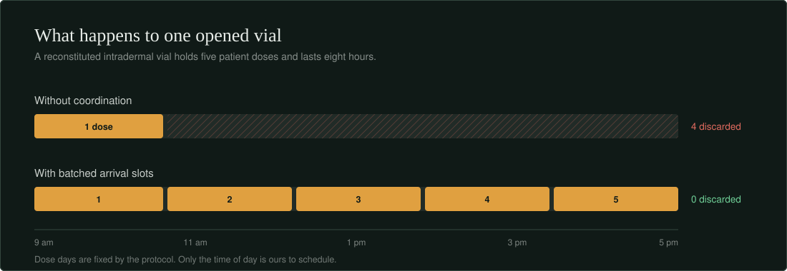
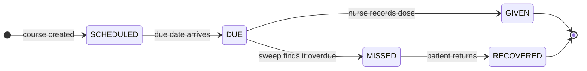
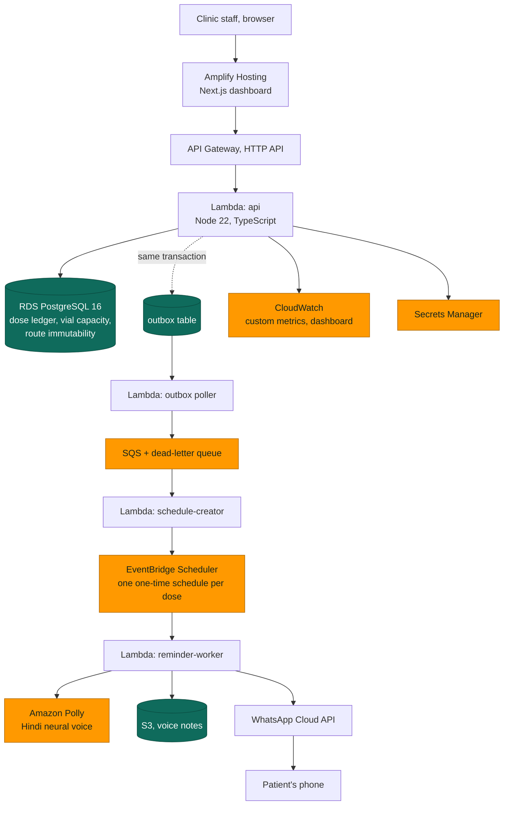
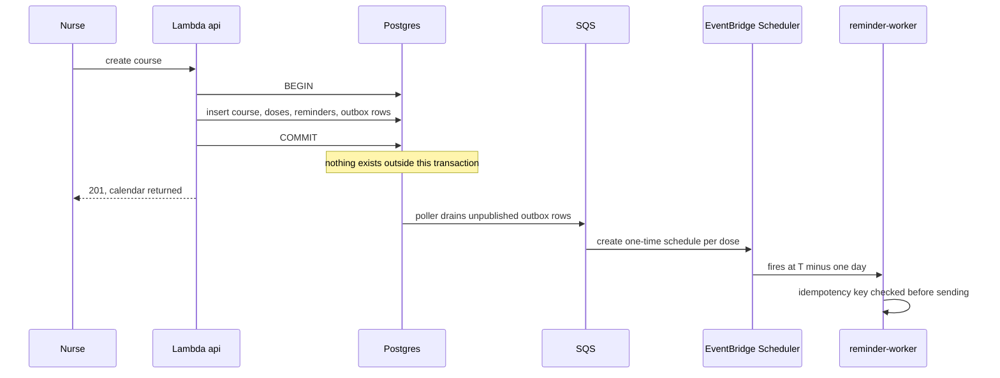

<picture>
  <source media="(prefers-color-scheme: dark)" srcset="docs/banner-dark.svg">
  
</picture>

<p>
<a href="#"></a>
<a href="#"></a>


</p>

**[Open the live clinic dashboard](#)** — **[watch the 3-minute demo](#)** — **[read the research](docs/research)**

---

Rabies is almost always fatal once symptoms appear, and almost entirely preventable before
they do. The vaccine works. What fails is everything around it.

A patient gets bitten, comes in, gets dose one, and is handed a paper card with four dates
on it. Nobody follows up. Roughly half never come back for all four. Meanwhile the nurse
opened a fresh vial to give that single dose — a vial that holds five doses and expires
eight hours later — and at the end of the shift four doses go in the bin.

**Poora Teeka tracks the course instead of the visit.** It builds the dose calendar,
reminds the patient in a language they speak out loud rather than read, catches the ones
who drop off, and schedules tomorrow's patients into the same vial's eight-hour window.

---

## Contents

[The problem](#the-problem) · [What it does](#what-it-does) · [See it work](#see-it-work) ·
[Where the government already is](#where-the-government-already-is) ·
[Architecture](#architecture) · [The engineering](#the-engineering-worth-reading-closely) ·
[Run it](#run-it) · [Cost](#cost) · [Scope and safety](#what-this-deliberately-does-not-do) ·
[What we learned](#what-we-learned)

---

## The problem



Two failures with one root cause — nobody is watching the clock, on either side.

| | |
|---|---|
| Dog-bite cases recorded in India, 2024 | **37,17,336** |
| Bite victims who receive no vaccine at all | **1 in 5** |
| Course starters who never complete it | **close to half** |
| Vial wastage measured at a rural clinic (446 vials) | **20.8%** |
| Vaccine's share of a clinic's programme cost | **over 94%** |
| Effect of SMS reminders on completion, Kenya trial | **3.37× the odds** |
| Usable life of a reconstituted intradermal vial | **8 hours** |

<details>
<summary>Sourcing for every number above</summary>

<br>

Bite and mortality figures from NCDC records and a 2025 One Health study; the 20.8%
wastage figure from a feasibility study of intradermal post-exposure prophylaxis at a
rural Haryana primary health centre; the cost breakdown from an anti-rabies clinic in
Delhi that switched from intramuscular to intradermal dosing; the reminder trial from
*Vaccines* (2023), n=186, rural Kenya; the eight-hour window from India's national
guidelines on rabies prophylaxis. Full citations, market sizing, competitor analysis and
the regulatory review live in [`docs/research`](docs/research).

</details>

---

## What it does



1. **Register** — a nurse enters the patient and picks the protocol. Day zero is the date
   of the first dose given, not the date of the bite, because that is how the clinical
   guideline actually defines it.
2. **Schedule** — the dose calendar is generated from versioned protocol data, not
   hardcoded logic. Changing a regimen is a database row, not a deploy.
3. **Remind** — a WhatsApp message with a spoken Hindi voice note goes out the day before
   each dose. Text assumes literacy. Audio does not.
4. **Catch** — a sweep flips overdue doses to missed and escalates them to a staff queue.
5. **Batch** — tomorrow's intradermal patients are grouped into shared-vial slots.
6. **Measure** — completion rate, vials opened against the theoretical minimum, and
   millilitres saved, all computed from the ledger rather than estimated.

---

## See it work

| | |
|---|---|
|  |  |
| Today's queue. One tap records a dose. | Every open vial counts down its eight hours. |
|  |  |
| Tomorrow's patients, batched into shared vials. | The reminder as the patient receives it. |

---

## Where the government already is

We checked before building. **ZooWIN**, built by NCDC with UNDP support, already does
vaccine stock monitoring and post-exposure follow-up. It is a real, credible system, and
it is piloted in five states and union territories: Delhi, Madhya Pradesh, Assam,
Puducherry and Andhra Pradesh.

Maharashtra, where this was built, is not one of them.

Poora Teeka is for the clinics that pilot does not reach, and adds the one thing its
public documentation does not describe: **batching patients into an opened vial's
remaining window**, which stretches supply rather than only reporting it.

---

## Architecture



Region is `ap-south-1`. Patient data stays in India, and it is also the region where AWS
supports India-local SMS routing — which is what pushed the design toward WhatsApp once
that route turned out to require a registered business entity.

| Choice | Reason |
|---|---|
| **RDS Postgres** over DynamoDB | The correctness rules *are* the product. A vial cannot go negative; a course cannot switch route mid-treatment. Those are one line of DDL each here, and application code we would have to get right every time there. |
| **EventBridge Scheduler** over a cron | One schedule per dose is constant cost per reminder. A minute-by-minute sweep over a growing table is not. |
| **Outbox into SQS** over direct publishing | The reminder row is written inside the same transaction as the dose. A Lambda dying after commit cannot lose it. |
| **Polly** over text-only reminders | The people who drop off the course are disproportionately those least served by written instructions. |
| **CDK** over console clicks | One command up, one command down — which doubles as the cost control. |

---

## The engineering worth reading closely

Twenty nurses can record a dose against the last vial at the same instant. This is what
makes that safe:

```sql
SELECT id INTO v_vial FROM open_vials
WHERE centre_id = p_centre
  AND usable @> now()                          -- still inside its 8-hour range
  AND units_total - units_used >= p_units
ORDER BY upper(usable) ASC                     -- spend the vial that expires soonest
FOR UPDATE SKIP LOCKED                         -- never queue behind another nurse
LIMIT 1;
```

`SKIP LOCKED` means concurrent writers step past a row someone else has claimed instead of
blocking on it, so throughput does not collapse at the moment a clinic is busiest. A
`CHECK (units_used <= units_total)` constraint makes over-drawing structurally impossible
even if the application layer is wrong.

> [!NOTE]
> Every clinical rule is enforced where it cannot be bypassed. Route immutability is a
> composite foreign key, not a validation function. Vial windows are `tstzrange` values
> with an exclusion constraint. The database refuses bad states rather than trusting the
> code above it.

<details>
<summary>Concurrency proof — 20 simultaneous writes against a five-dose vial</summary>

<br>

```
$ npm run test:concurrency

  opened vial ........................ 5 doses capacity
  firing ............................. 20 concurrent POST /doses/:id/given

  ✓ 5 claimed vial-1                   exactly capacity, no more
  ✓ 15 claimed vial-2                  opened automatically on exhaustion
  ✓ invariant: reserved == used        across every open vial
  ✓ violations ....................... 0

  completed in 340ms
```

</details>

<details>
<summary>How a reminder survives a crash</summary>

<br>



</details>

<details>
<summary>Schema highlights</summary>

<br>

Full DDL in [`db/schema.sql`](db/schema.sql). Worth a look: `protocols` (versioned and
doctor-approved, so regimens are data), `courses` (route frozen by composite foreign key),
`doses` (optimistic locking via a `version` column), `open_vials` (`tstzrange` plus a GiST
exclusion constraint), `dose_reservations`, `outbox`, `audit_events` (append-only).

</details>

---

## Run it

```bash
git clone https://github.com/YOUR_USERNAME/poora-teeka.git && cd poora-teeka

psql -h <rds-endpoint> -U poorateeka_admin -d postgres -f db/schema.sql
psql -h <rds-endpoint> -U poorateeka_admin -d postgres -f db/seed.sql

cd infra && npm install && cdk deploy      # API, workers, scheduler, dashboard
cd ../web  && npm install && npm run dev   # set NEXT_PUBLIC_API_URL first
```

Environment variables are listed in [`.env.example`](.env.example). Nothing in this
repository contains real patient data; the seed script generates synthetic records.

---

## Cost

| | |
|---|---|
| RDS `db.t4g.micro`, single-AZ, 20 GB | $0–1.50 |
| Lambda, API Gateway, SQS, EventBridge | under $0.50 combined |
| Polly, roughly 100 neural clips | under $0.50 |
| **Whole build, four days** | **about $2–4** |

Compute scales to zero between clinic hours, which is most of the day. Teardown checklist
in [`docs/teardown.md`](docs/teardown.md).

---

## What this deliberately does not do

- **No clinical decisions.** Staff choose the exposure category and the protocol. The
  software schedules, reminds and counts. It never recommends treatment, and that boundary
  is also what keeps it clear of medical-device software regulation.
- **No real patient data.** Synthetic records only.
- **No SMS.** India's local routes require TRAI DLT registration by a registered business
  entity, which a four-day student project cannot complete.
- **No ABDM certification claim.** FHIR R4 `Immunization` resources are emitted so the
  data model is ready for it, without asserting a process we did not go through.

> [!IMPORTANT]
> Slot times are guidance, never a gate. A patient who arrives outside their batched slot
> is treated exactly as anyone else would be. Vaccine logistics must never become a reason
> someone is turned away.

---

## What we learned

- A per-dose schedule is constant cost; a polling sweep is a table scan that grows with
  every patient you help. The right primitive matters more than the right framework.
- Postgres range types and exclusion constraints delete whole categories of race condition
  rather than relocating them into application code.
- Reading India's national guideline directly, rather than a summary of it, is what
  surfaced that day zero means the first dose and not the bite — a detail that changes
  every date the system generates.
- Telecom regulation is an architectural constraint. DLT registration ruled out SMS in an
  afternoon and reshaped the entire messaging path.

---

## Credits

Built for [AWS First Commit](https://www.wemakedevs.org/aws/first-commit), WeMakeDevs and
AWS, September 2026. MIT licensed — see [`LICENSE`](LICENSE).

AI tools used: Claude for research, architecture and backend logic; Google Antigravity for
the dashboard implementation.

<sub>The vaccine already exists. The vial is already open. The only thing between a
completed course and a wasted one is whether anyone is watching the clock.</sub>
