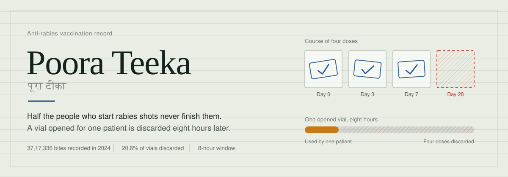
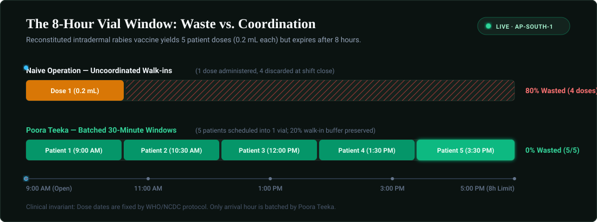

<div align="center">

<picture>
  <source media="(prefers-color-scheme: dark)" srcset="docs/banner-dark.svg">
  
</picture>

# Poora Teeka
### पूरा टीका — Complete the Vaccine

[](YOUR_YOUTUBE_URL)
[](YOUR_AMPLIFY_URL)
[](https://ap-south-1.console.aws.amazon.com)
[](https://www.wemakedevs.org/aws/first-commit)



*Built for AWS First Commit · WeMakeDevs × AWS Bharat Builds Tour · September 2026*

</div>

**A dose-completion and vial-logistics system for anti-rabies clinics in India.**

---

## The problem

| Stat | Source |
|------|--------|
| **37 lakh** dog bites recorded per year in India | NCDC |
| **~50%** of patients who start the rabies course never finish it | WHO India |
| **~20%** of opened intradermal vials are discarded unused | Field studies |
| Rabies fatality rate once symptomatic | **~100%** |

Rabies is almost entirely preventable with a completed vaccine course. But patients forget doses — or can't afford a second trip to the clinic. Meanwhile, clinics throw away vaccine: a reconstituted intradermal vial must be used within **8 hours** or discarded.

The government's **ZooWIN** platform covers 5 states. Maharashtra — including Pune, our target — **is not one of them.**

---

## What it does

```
Nurse registers patient → Dose calendar generated → WhatsApp + Hindi voice reminder sent
                                                  → Missed dose detected automatically
                                                  → Tomorrow's patients batched into shared-vial slots
```

**Six things working together:**

1. **Dose calendar** — staff pick the protocol (ID or IM), system generates all dates from day 0
2. **WhatsApp reminder** — sent the day before each dose, with a Hindi voice note from Amazon Polly
3. **Missed-dose detection** — automatic sweep every 5 min (demo) / daily (production)
4. **Jev triage** — each missed dose is classified as `routine / priority / critical` by TypeSafe AI
5. **Vial batching** — tomorrow's intradermal patients are grouped into shared-vial time slots
6. **Patient portal** — patient clicks the WhatsApp link, sees their dose progress in their language

---

## Architecture



The architecture is intentionally vertical: a request enters at API Gateway, travels through Lambda into Postgres, and any side effect (a reminder, a schedule) exits through the outbox — never from inside the transaction that caused it.

### AWS services

| Service | Role |
|---------|------|
| **API Gateway HTTP API** | Single entry point for all clinic and patient requests |
| **Lambda** (Node.js 22) | Course engine, vial engine, outbox poller, schedule creator, reminder worker, missed-dose sweep |
| **RDS PostgreSQL 18.6** | Correctness constraints enforced at DB level — not app code |
| **EventBridge Scheduler** | One one-time schedule per dose reminder (O(1) per dose) |
| **SQS + DLQ** | Async reminder pipeline, 3 retries before dead-letter |
| **Amazon Polly** | Hindi neural voice (Kajal) for voice reminders |
| **S3** | Voice note mp3 storage, presigned URLs |
| **AWS Amplify** | Next.js 14 dashboard hosting |
| **Secrets Manager** | WhatsApp token, DB credentials, TypeSafe API key |
| **CloudWatch** | Custom metrics (RemindersSent, RemindersFailed), DLQ alarm, dashboard |
| **AWS CDK (TypeScript)** | Entire stack as code — one `cdk deploy`, one `cdk destroy` |

**Region: ap-south-1 (Mumbai)** — data residency for Indian patients.

---

## The engineering that matters

### Concurrency-safe vial reservation

Twenty nurses can record a dose against the same vial at the same instant. Here is what happens in Postgres:

```sql
SELECT id INTO v_vial
FROM open_vials
WHERE centre_id = p_centre
  AND usable @> now()
  AND units_total - units_used >= p_units
ORDER BY upper(usable) ASC
FOR UPDATE SKIP LOCKED      -- each nurse gets a different vial, no blocking
LIMIT 1;
```

`FOR UPDATE SKIP LOCKED` means callers skip rows already locked by another session instead of queuing behind them. A `CHECK (units_used <= units_total)` constraint makes it structurally impossible for a vial to go negative — even if application code has a bug.

**Load test result:** 20 concurrent writes against one vial sized for 5 → exactly 5 succeed against the first vial, second vial opens automatically, zero invariant violations.

> 📸 **Insert screenshot: concurrency test terminal output here**

### Transactional outbox

A course creation does three things in one Postgres transaction:
1. Inserts dose rows
2. Inserts reminder rows
3. Inserts outbox rows (one per reminder)

If Lambda crashes after step 1 but before SQS is called — no problem. The outbox poller picks up unprocessed rows on its next 1-minute run. Nothing is lost.

```
Course created ──(same transaction)──► outbox row
                                           │
                               ┌────────────▼──────────────┐
                               │    Outbox poller Lambda    │
                               │    runs every 1 minute     │
                               └────────────┬──────────────┘
                                            │
                                           SQS
                                            │
                               ┌────────────▼──────────────┐
                               │  Schedule-creator Lambda   │
                               │  EventBridge one-time      │
                               │  schedule per dose         │
                               └────────────┬──────────────┘
                                            │
                                     (fires at T-1 day)
                                            │
                               ┌────────────▼──────────────┐
                               │  Reminder-worker Lambda    │
                               │  Polly → S3 → WhatsApp    │
                               └───────────────────────────┘
```

### Why EventBridge Scheduler over a cron

A polling cron that checks "which doses are due tomorrow" scales with table size — the query gets slower as the database grows. EventBridge one-time schedules are O(1) per dose: one schedule created at course time, fires exactly once, done. Default quota: 10 million schedules per region.

### Why Postgres over DynamoDB

The product's core value *is* constraints. A vial cannot serve a negative number of doses. A route cannot change mid-course. These invariants are enforced by the database itself — `CHECK` constraints and range type operators — not by application logic that can be bypassed.

---

## Dashboard

> 📸 **Insert screenshot: Today screen here**

> 📸 **Insert screenshot: Vials screen with countdown timers here**

> 📸 **Insert screenshot: Batching plan before/after here**

> 📸 **Insert screenshot: Patient portal (mobile) here**

**Five screens:**

- `/` — Today's doses, Record button per card
- `/register` — Patient registration, dose calendar shown on success
- `/vials` — Open vial cards with live countdown (red under 60 min)
- `/plan` — Tomorrow's batching suggestion, vials saved vs naive baseline
- `/dashboard` — Completion funnel, vials saved, reminder delivery rate
- `/s/[token]` — Patient-facing portal, language-localized

---

## Vial batching — the numbers

```
Without batching:  7 patients × 1 vial each  = 7 vials opened
With batching:     7 patients in 3 time slots = 3 vials opened
                                                4 vials saved
                                                ~0.7ml saved per patient
                                                ₹1,600 saved per clinic day
```

Dose days are fixed by protocol — we only control the time of day. Patients are greedy-grouped into 30-minute slots, 20% capacity reserved for walk-in day-0 patients. Slot is advice, never a gate.

---

## Jev integration

Missed doses are not equal. A patient who missed dose 1 of 5 is different from one who missed dose 4 of 5. TypeSafe AI's Jev model classifies each missed dose post-commit:

```typescript
const result = await jev.systemOne({
  state: {
    doses_missed: patient.missedCount,
    doses_given: patient.givenCount,
    dose_sequence: dose.seq_no,
    days_since_last_dose: daysSinceLast,
    route: course.route,
  },
  questions: {
    escalation_level: choice("How urgently should staff follow up?", {
      routine: "Standard reminder, low dropout risk",
      priority: "Call the patient today",
      critical: "Contact immediately — late in course, rabies risk is real",
    }),
  },
});
```

If Jev fails, the sweep continues — it's enrichment, not a gate. The dashboard colour-codes missed doses: yellow (routine), orange (priority), red (critical).

---

## Clinical protocols supported

| Protocol | Route | Schedule | Dose |
|----------|-------|----------|------|
| Updated Thai Red Cross | Intradermal (ID) | Day 0, 3, 7, 28 | 0.2 ml per visit |
| Essen | Intramuscular (IM) | Day 0, 3, 7, 14, 28 | 1 full vial per visit |

**Day 0 is the date of the first dose, not the bite date.** The software never makes clinical decisions — staff choose exposure category and protocol.

---

## FHIR R4 export

```http
GET /fhir/Immunization/{doseId}
```

Returns a compliant HL7 FHIR R4 `Immunization` resource with `resourceType`, `status`, `vaccineCode` (SNOMED CT + CVX), `patient` reference, `occurrenceDateTime`, `lotNumber`, and `protocolApplied`. The data model is ABDM-ready without claiming certification we cannot obtain in 4 days.

---

## Running locally

```bash
# 1. Clone
git clone https://github.com/lohitakshcodes/Poora-Teeka.git
cd Poora-Teeka

# 2. Install
cd api && npm install
cd ../web && npm install
cd ../infra && npm install

# 3. Set environment variables
cp api/.env.example api/.env
# Fill in: DB_HOST, DB_PORT, DB_NAME, DB_USER, DB_PASSWORD,
#          WHATSAPP_TOKEN, WHATSAPP_PHONE_NUMBER_ID,
#          TYPESAFE_API_KEY

# 4. Apply schema and seed
npx ts-node db/migrate.ts
npx ts-node db/seed-demo.ts

# 5. Run frontend
cd web && npm run dev
# → http://localhost:3000

# 6. Deploy AWS stack
cd infra && cdk deploy
```

---

## What this deliberately does not do

- **No clinical decisions** — staff choose exposure category and protocol; software only schedules and tracks
- **No real patient data** — all data in this build is synthetic
- **No SMS** — India's local SMS routes require TRAI DLT registration by a registered business entity
- **No ABDM certification** — FHIR R4 data model is compatible; certification requires milestone clearance we cannot complete in 4 days
- **No Amazon Connect voice calls** — not supported for India outbound

---

## Known limitations (honest)

| Limitation | Production fix |
|------------|----------------|
| RDS public access | Private subnet + RDS Proxy |
| WhatsApp sandbox (5 numbers) | Business verification |
| Sequential Jev loop | `Promise.allSettled` fan-out at scale |
| Lambda concurrency ceiling | Reserved concurrency + provisioned Lambda |

---

## Scale analysis

> *"Is this just a CRUD app?"*

No. The correctness proof is in the concurrency test: 20 concurrent writers, zero invariant violations, automatic vial rotation. At Maharashtra scale (~500 clinics, ~10,000 patients/day), the architecture holds — the outbox pattern and EventBridge schedules are O(doses), not O(table-size).

The one known bottleneck at 10x load is the sequential Jev enrichment loop. Fix: `Promise.allSettled` fan-out or a dedicated Jev-enrichment Lambda triggered by the missed-dose outbox event. Already documented in code comments.

---

## AI tools used

*(Required disclosure per hackathon rules)*

- **Claude Code** — backend architecture, Lambda handlers, CDK stack, system audit
- **Google Antigravity** — parallel frontend development
- **TypeSafe AI Jev** — runtime missed-dose escalation (product feature, not just a tool)

---

## Team

| | Role |
|-|------|
| **Lohitaksh Bisen** | Backend, AWS infrastructure, system design |
| **Tanvi Hardas** | Frontend, dashboard, patient portal |

*MIT WPU, Pune · Third year · Graduating 2028*

---

## Where to place your screenshots

Add these files to `docs/` and the README will populate automatically:

```
docs/
├── banner.png          ← project banner (1200×400px recommended)
├── today-screen.png    ← /  screen
├── vials-screen.png    ← /vials screen with countdown
├── plan-screen.png     ← /plan before/after
├── portal-mobile.png   ← /s/[token] on mobile
└── concurrency-test.png ← terminal output of load test
```

---

<div align="center">

Built in 72 hours · September 17–20, 2026 · AWS First Commit · WeMakeDevs × AWS

*ZooWIN covers 5 states. Maharashtra isn't one of them.*

</div>
